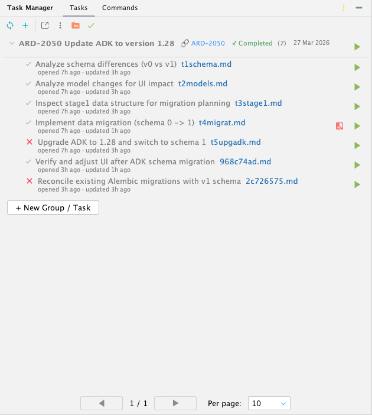
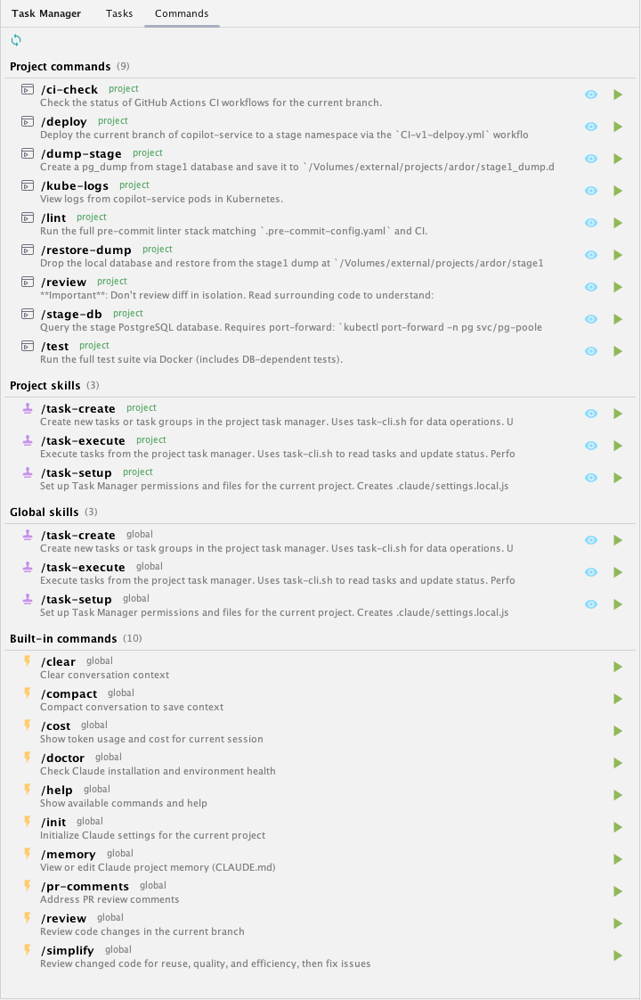

# Task Manager — JetBrains Plugin

A task management plugin for JetBrains IDEs (PyCharm, IntelliJ IDEA, WebStorm, etc.) with Claude Code, Codex, and Kiro CLI integration. Manage project tasks from the IDE and execute them via agent skills in the terminal.

> **Note:** This plugin is not published to the JetBrains Marketplace. Install it manually from a ZIP file (see below).

## Features

- **Task groups** with collapsible lists and automatic status tracking
- **Task statuses:** New, In Progress, Completed, Paused, Cancelled
- **Markdown docs:** Each task links to a `.md` file with detailed description, plan, and results
- **Agent integration:** Run tasks via `task-execute` and create them via `task-create` skills in Claude Code, Codex, or Kiro CLI
- **External tracker links:** Detects Linear, Jira, GitHub Issues, and YouTrack IDs in group names and renders clickable links
- **Auto-create issues:** When creating tasks, can automatically create issues in external trackers via MCP
- **Commit tracking:** Tasks store commit hashes with a diff button to view changes in Git Log
- **CLI helper:** `task-cli.sh` script for agents to manage tasks without parsing raw JSON
- **Smart ordering:** Completed groups sink to the bottom, appear faded, and auto-collapse
- **Pagination** with configurable page size
- **Commands tab:** Browse commands and skills for the configured agent and run them with one click
- **Multiple views:** Side panel, bottom panel, or editor tab (center area)
- **Auto-archiving** of completed groups to keep `tasks.json` compact

## Screenshots

<table>
  <tr>
    <td align="center">
      <br/>
      <sub><b>Tasks panel</b> — groups, statuses, timestamps, commit links</sub>
    </td>
    <td align="center">
      <br/>
      <sub><b>Commands tab</b> — browse and run configured agent commands and skills</sub>
    </td>
  </tr>
</table>

## Requirements

- JetBrains IDE 2025.3+ (PyCharm, IntelliJ IDEA, WebStorm, etc.)
- JDK 21 for building (`brew install openjdk@21` on macOS)
- [Claude Code CLI](https://docs.anthropic.com/en/docs/claude-code), Codex CLI, or Kiro CLI for task execution

## Build

```bash
export JAVA_HOME=/opt/homebrew/opt/openjdk@21/libexec/openjdk.jdk/Contents/Home
./gradlew buildPlugin
```

The plugin ZIP will be in `build/distributions/`.

## Install the plugin

1. Build the plugin (see above) or download a release ZIP
2. Open your JetBrains IDE > **Settings** (`Cmd+,` / `Ctrl+Alt+S`)
3. Go to **Plugins**
4. Click the **gear icon** (top right) > **Install Plugin from Disk...**
5. Select the `.zip` file from `build/distributions/`
6. Click **OK** and **restart** the IDE

After restart, the **Task Manager** tab appears in the right side panel.

## Install agent skills

The plugin relies on task skills for creating and executing tasks.

### Option A: Install from the plugin UI (per-project)

1. Open the **Task Manager** panel in the IDE
2. Pick the agent in the toolbar or **Tracker Settings** (Claude Code by default, Codex, or Kiro)
3. Click the **Install Agent Skills** button (folder icon) in the toolbar
4. Skills are copied to `<project>/.claude/skills/` for Claude, `~/.agents/skills/` for Codex, or `~/.kiro/skills/` for Kiro. `task-cli.sh` is copied to the configured task directory.

### Option B: Install globally (all projects)

```bash
mkdir -p ~/.claude/skills/task-execute ~/.claude/skills/task-create
cp skills/task-execute/SKILL.md ~/.claude/skills/task-execute/SKILL.md
cp skills/task-create/SKILL.md ~/.claude/skills/task-create/SKILL.md
```

### Configure permissions (optional)

To let Claude run task management commands without repeated prompts, either:

- Click the **Setup Permissions** button (🔒) in the Task Manager toolbar — it runs `/task-setup` which creates `.claude/settings.local.json` with the right rules
- Or run `/task-setup` manually in Claude

This creates a gitignored `.claude/settings.local.json` with permissions for `task-cli.sh`, git, and the supported task directories. Add more rules as needed (e.g. `Bash(./gradlew:*)`, `Bash(npm:*)`).

After installing, the skills are available in Claude:

- **`/task-execute <id>`** — Executes a task or group by ID. Follows a structured workflow: analyze → plan → implement → review → test → get feedback → commit → update status.
- **`/task-create "Group" "Task" "Description"`** — Creates a new task group and/or task. Generates a markdown file with description, instructions, and acceptance criteria templates.

With Codex or Kiro selected, toolbar actions start the configured CLI with a prompt that explicitly asks it to use the matching `task-create`, `task-execute`, or `task-setup` skill.

## Usage

### UI

| Action | How |
|--------|-----|
| Open panel | Click **Task Manager** tab in the right sidebar |
| Open as editor tab | **Tools > Open Task Manager** or click the window icon in the toolbar |
| Move to bottom | Drag the tool window tab to the bottom bar |
| Create task | Click **+** in toolbar or **+ New Group / Task** at the bottom — opens the configured agent with `task-create` |
| Run task | Click the ▶ play button on a task or group — opens the configured agent with `task-execute` |
| View details | Click the 📄 link on a task to open its markdown file |
| View commit diff | Click the diff icon on a completed task to open its commit in Git Log |
| Refresh | Click 🔄 in toolbar |
| Configure tracker | Click ⚙ in toolbar |
| Choose agent | Use the agent selector in the toolbar, or click ⚙ and select Claude Code, Codex, or Kiro |
| Choose task storage | Click ⚙ in toolbar and select Auto, `.claude/tasks`, `.agents/tasks`, `.kiro/tasks`, or `.idea/agents-tasks` |
| Browse commands | Switch to the **Commands** tab in the tool window |
| Run a command | Click ▶ on any command/skill in the Commands tab |
| View command source | Click 👁 to open the `.md` file in the editor |

### External tracker integration

1. Click the ⚙ gear icon in the toolbar
2. Select your tracker type (Linear, Jira, GitHub Issues, YouTrack)
3. Enter the base URL (e.g. `https://linear.app/yourteam`)
4. Click OK

When a group name contains a tracker ID (e.g. `ENG-123 Implement auth`), a clickable 🔗 link appears next to it. Clicking opens the issue in your browser.

If a Linear MCP server is connected to Claude, the `/task-create` skill will automatically create issues in Linear and prepend the ID to the group name.

### Data storage

All task data lives inside the project, in a directory ignored by git. Storage is configurable:

- `Auto`: if `.claude/tasks` already exists, use it for backward compatibility; otherwise Claude creates `.claude/tasks`, Codex creates `.agents/tasks`, and Kiro creates `.kiro/tasks`. Opening the panel alone does not create storage.
- `.claude/tasks`: legacy Claude-compatible storage.
- `.agents/tasks`: agent-neutral local storage.
- `.kiro/tasks`: Kiro-local storage.
- `.idea/agents-tasks`: IDE-local storage for teams that prefer task files under `.idea`.

```
<project>/<task-storage>/
├── tasks.json        # Active groups and tasks
├── archive.json      # Auto-archived completed groups
├── config.json       # Tracker, agent, and storage settings
├── task-cli.sh       # CLI helper for agents
└── docs/             # Markdown files with task details
    └── <groupId>/
        └── <taskId>.md
```

### CLI helper for agents

The `task-cli.sh` script allows agents to manage tasks without reading/writing raw JSON:

```bash
TASKS_DIR="${TASK_MANAGER_TASKS_DIR:-.claude/tasks}"
bash "$TASKS_DIR/task-cli.sh" list                          # active tasks + tracker config
bash "$TASKS_DIR/task-cli.sh" list --all                    # all tasks including completed
bash "$TASKS_DIR/task-cli.sh" list --group <id>             # tasks in a specific group
bash "$TASKS_DIR/task-cli.sh" list --status in_progress     # filter by status
bash "$TASKS_DIR/task-cli.sh" get <id>                      # task or group details (JSON)
bash "$TASKS_DIR/task-cli.sh" status <taskId> completed     # update task status
bash "$TASKS_DIR/task-cli.sh" commit <taskId> <hash>        # attach commit hash
bash "$TASKS_DIR/task-cli.sh" add-group "Group Name"        # create group (prints ID)
bash "$TASKS_DIR/task-cli.sh" add-task <gid> "Name" "Desc"  # create task (prints ID)
bash "$TASKS_DIR/task-cli.sh" config                        # show tracker config
```

By default, `list` shows only active tasks (new, in\_progress, paused) and includes tracker config at the top — no need to call `config` separately.

## Development

Run a sandboxed IDE instance with the plugin loaded (no install needed):

```bash
export JAVA_HOME=/opt/homebrew/opt/openjdk@21/libexec/openjdk.jdk/Contents/Home
./gradlew runIde
```

### Targeting a different IDE

By default, the plugin targets PyCharm (`PY`). To target IntelliJ IDEA, change in `gradle.properties`:

```properties
platformType = IC
```

Common values: `PY` (PyCharm), `IC` (IntelliJ Community), `IU` (IntelliJ Ultimate), `WS` (WebStorm).

## License

MIT
